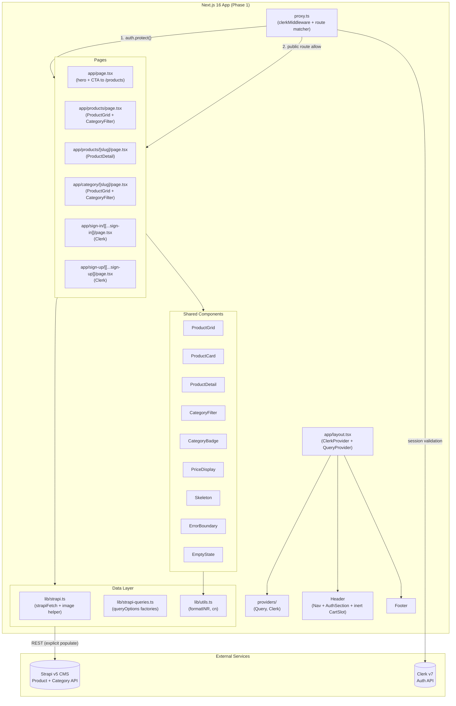
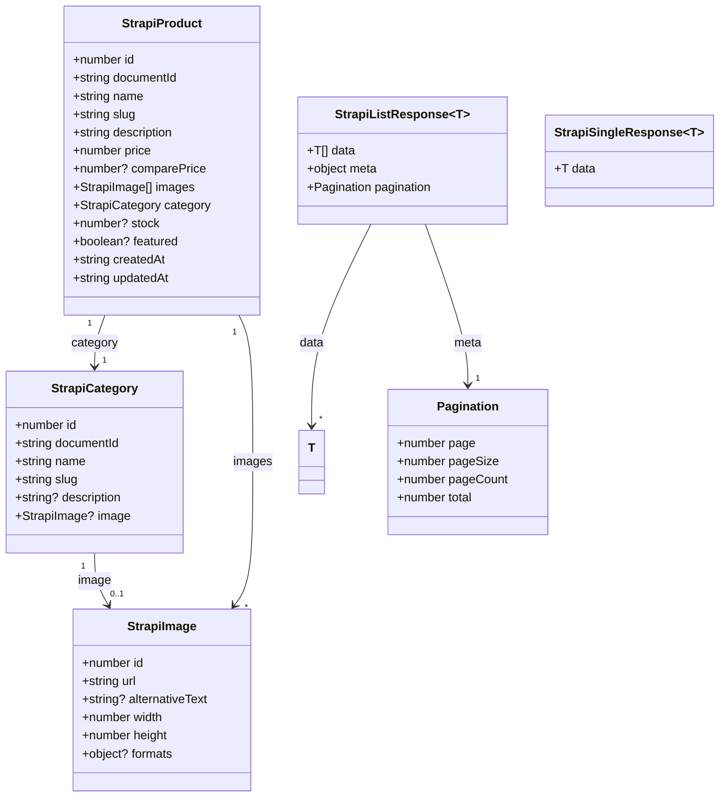
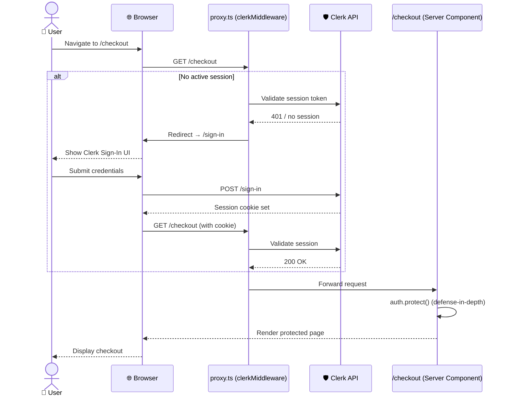
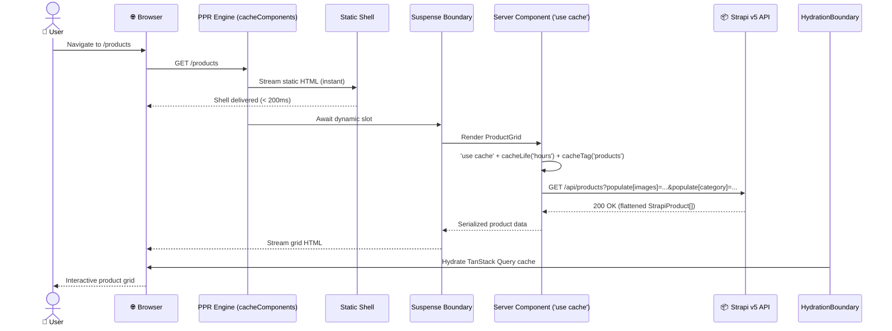

# AuraStore — Low-Level Design (LLD): Phase 1 (Basic/MVP)

> **Project:** AuraStore: The Modern Consumer App
> **Version:** 1.0
> **Status:** Draft
> **Date:** July 14, 2026
> **Document Type:** Low-Level Design (Implementation)
> **Parent Document:** [AuraStore HLD](../AuraStore_HLD.md)
> **Phase:** Phase 1 — Basic/MVP (Clerk auth, Strapi product catalog, product browsing, layout)
> **Audience:** Developers, testers

---

## Table of Contents

1. [Document Header](#1-document-header)
2. [Scope & Objectives](#2-scope--objectives)
3. [Assumptions, Constraints & Dependencies](#3-assumptions-constraints--dependencies)
4. [Detailed Design](#4-detailed-design)
   - [4.1 Component Architecture](#41-component-architecture)
   - [4.2 Module / Component Design](#42-module--component-design)
   - [4.3 Sequence Diagrams](#43-sequence-diagrams)
   - [4.4 API / Data Contracts](#44-api--data-contracts)
   - [4.5 Data Design](#45-data-design)
5. [Error Handling Strategy](#5-error-handling-strategy)
6. [Security Considerations](#6-security-considerations)
7. [Performance Considerations](#7-performance-considerations)
8. [Observability Plan](#8-observability-plan)
9. [Testing Strategy](#9-testing-strategy)
10. [Deployment & Rollout](#10-deployment--rollout)
11. [Open Questions & Risks](#11-open-questions--risks)

---

## 1. Document Header

### 1.1 Purpose

This Low-Level Design document defines the **how** (component-level design, interface contracts, and implementation patterns) for **Phase 1** of AuraStore. It translates the High-Level Design (HLD) and Requirements into actionable specifications for developers and testers.

### 1.2 Scope Summary

- **In Scope:** Clerk authentication, Strapi product catalog integration, product listing/detail pages, category filtering, responsive layout, PPR-enabled Next.js 16 app.
- **Out of Scope (Phase 2):** Shopping cart, checkout, Razorpay payment integration, order management, toast notifications.
- **Out of Scope (Phase 3):** Animations, search/sorting, dark mode, SEO, wishlist, accessibility hardening.

### 1.3 Tech Stack (Locked)

| Layer | Technology | Version | Notes |
|-------|-----------|---------|-------|
| Framework | Next.js | **16.2+** | App Router, PPR via `cacheComponents: true`, Turbopack default |
| Runtime | Node.js | **v22.x** | Required for Next 16 |
| Language | TypeScript | **v5.x** | Strict mode |
| Styling | Tailwind CSS | **v4.3+** | CSS-first: `@import "tailwindcss"`, `@theme` blocks; no `tailwind.config.js` |
| UI Library | shadcn/ui | v2+ | `style: new-york`, `rsc: true`, `cssVariables: true` |
| Auth | Clerk | **v7.x** | `proxy.ts` network boundary, async `auth()`, `auth.protect()` |
| CMS | Strapi | **v5.x** | Flattened response (`documentId`, no `attributes` wrapper), explicit `populate` |
| Data Fetching | TanStack Query | **v5.90+** | `queryOptions` factory, `isPending`, `gcTime` |
| HTTP Client | Native `fetch` | — | Wrapped in `lib/strapi.ts` |
| Query String | `qs` | — | Strapi query builder |

---

## 2. Scope & Objectives

### 2.1 In-Scope Functional Requirements

| FR ID | Requirement | Phase 1 Module |
|-------|-------------|----------------|
| FR1 | Sign up with email/password | `proxy.ts` + `AuthSection` |
| FR2 | Sign in with email/password | `AuthSection` |
| FR3 | Sign out | `AuthSection` |
| FR4 | Authenticated users see profile menu | `AuthSection` |
| FR5 | Unauthenticated users see sign-in/sign-up | `AuthSection` |
| FR6 | Protected routes redirect to sign-in | `proxy.ts` + `auth.protect()` |
| FR7 | Admin manages products via Strapi | Strapi Admin (manual) |
| FR8 | Admin manages categories via Strapi | Strapi Admin (manual) |
| FR9 | Products filterable by category | `CategoryFilter` + `ProductGrid` |
| FR10 | Draft/publish workflow | Strapi (server-side) |
| FR11 | Seed 10–20 products / 4–5 categories | Strapi seed script |
| FR12 | View product grid (image, name, price, badge) | `ProductGrid`, `ProductCard`, `PriceDisplay`, `CategoryBadge` |
| FR13 | View product detail (images, description, price, category) | `ProductDetail`, `ProductCard` |
| FR14 | Filter products by category | `CategoryFilter` |
| FR15 | Loading skeletons while data loads | `Skeleton` |
| FR16 | Graceful error handling | `ErrorBoundary` |
| FR17 | Header with logo, nav, auth buttons | `Header`, `Nav`, `AuthSection` |
| FR18 | Footer with links and branding | `Footer` |
| FR19 | Responsive layout (mobile, tablet, desktop) | `RootLayout`, `Header`, `ProductGrid` |

### 2.2 Out-of-Scope (with Phase seam note)

| Feature | Phase | Note |
|---------|-------|------|
| Cart state & UI | 2 | Header reserves an inert `<CartSlot />` placeholder; no `lib/cart.ts` created |
| Checkout & Razorpay | 2 | No `/checkout` route, no payment API routes |
| Order management | 2 | No `/orders` routes |
| Toast notifications | 2 | No `Sonner` provider in Phase 1 |
| Search, sort, wishlist | 3 | No search bar, sort dropdown, or wishlist buttons |
| Dark mode | 3 | Single light theme via Tailwind `@theme` |
| Animations | 3 | No Framer Motion in Phase 1 |

---

## 3. Assumptions, Constraints & Dependencies

### 3.1 Assumptions

- **Node.js v22+** is installed and used for both frontend and backend tooling.
- A **Strapi v5** instance is available (local dev at `localhost:1337` or cloud). The API uses the **flattened response contract** (`documentId`, no `attributes` wrapper).
- A **Clerk v7** application is provisioned with email+password sign-in method enabled.
- **Secrets** (`STRAPI_API_TOKEN`, `CLERK_SECRET_KEY`) are stored server-only (`.env.local` / Vercel env) and never exposed to the client (`NEXT_PUBLIC_`).
- **Decoupled architecture** is respected: Next.js frontend never directly accesses the Strapi database; all data flows through the Strapi REST API.
- Product prices are stored and treated as **whole INR rupees** (no paise/sub-unit). Values like `249900` represent ₹2,49,900. `formatINR()` formats the number directly without division.

### 3.2 Constraints

- **No custom backend** outside of Strapi and Next.js API routes (none in Phase 1).
- **No `middleware.ts`** — Next.js 16 renamed the network-boundary file to `proxy.ts`.
- **No `tailwind.config.js`** — Tailwind v4 uses CSS-first configuration (`@import "tailwindcss"` + `@theme`).
- **No `populate=*`** in production Strapi queries — use explicit `fields` + `populate` via `qs` to avoid ~320× payload inflation.
- **Phase 1 scope freeze:** No cart, checkout, payment, order, or wishlist code paths are introduced.

### 3.3 External Dependencies

| Service | Purpose | Account Required |
|---------|---------|-----------------|
| Clerk | Authentication, session management | Yes (Clerk Dashboard) |
| Strapi | Product/category CMS | Yes (local or cloud instance) |
| Vercel | Frontend hosting (production) | Yes (Vercel account) |

---

## 4. Detailed Design

### 4.1 Component Architecture

The following flowchart maps Phase 1 modules, their dependencies, and external service boundaries.



### 4.2 Module / Component Design

#### 4.2.1 Type Relationships



#### 4.2.2 Module Specifications

**Module: `lib/strapi.ts` — Thin API Client**

- **Responsibility:** Centralize all Strapi REST calls, normalize responses, handle secrets server-only.
- **Dependencies:** `NEXT_PUBLIC_STRAPI_API_URL`, `STRAPI_API_TOKEN` (server-only).
- **Key Snippet:**

```typescript
// lib/strapi.ts
const STRAPI_URL = process.env.NEXT_PUBLIC_STRAPI_API_URL || 'http://localhost:1337';
const STRAPI_TOKEN = process.env.STRAPI_API_TOKEN;

interface StrapiFetchOptions extends RequestInit {
  headers?: Record<string, string>;
}

async function strapiFetch<T>(endpoint: string, options: StrapiFetchOptions = {}): Promise<T> {
  const url = `${STRAPI_URL}/api${endpoint}`;
  const headers: Record<string, string> = {
    'Content-Type': 'application/json',
    ...(STRAPI_TOKEN ? { Authorization: `Bearer ${STRAPI_TOKEN}` } : {}),
    ...options.headers,
  };

  const response = await fetch(url, { ...options, headers });

  if (!response.ok) {
    const text = await response.text();
    let message = `Strapi ${response.status}`;
    try { const err = JSON.parse(text); message = err.error?.message || message; } catch {}
    throw new Error(`Strapi API error ${response.status}: ${message}`);
  }

  return response.json();
}

export function strapiMedia(image: { url: string }): string {
  if (!image?.url) return '';
  if (image.url.startsWith('http')) return image.url;
  return `${STRAPI_URL}${image.url}`;
}
```

**Module: `lib/strapi-queries.ts` — Query Builder + Factory**

- **Responsibility:** Build explicit Strapi query params with `qs`; export `queryOptions` factories for shared server/client definitions.
- **Dependencies:** `lib/strapi.ts`, `qs`, `next` (`cacheLife`, `cacheTag`).

```typescript
// lib/strapi-queries.ts
import { qs } from 'qs';
import { strapiFetch, type StrapiProduct, type StrapiCategory, type StrapiListResponse } from './strapi';

const productPopulate = {
  images: { fields: ['url', 'alternativeText', 'width', 'height', 'formats'] },
  category: { fields: ['id', 'name', 'slug'] },
};

const categoryPopulate = {
  image: { fields: ['url', 'alternativeText'] },
};

export async function getProducts(params?: {
  category?: string;
  sort?: string;
}): Promise<StrapiListResponse<StrapiProduct>> {
  const query = qs.stringify(
    {
      populate: productPopulate,
      sort: params?.sort || 'name:asc',
      ...(params?.category && { filters: { category: { slug: { $eq: params.category } } } }),
    },
    { encodeValuesOnly: true }
  );
  return strapiFetch<StrapiListResponse<StrapiProduct>>(`/products?${query}`);
}

export async function getProductBySlug(slug: string): Promise<StrapiProduct> {
  const query = qs.stringify(
    { populate: productPopulate, filters: { slug: { $eq: slug } }, limit: 1 },
    { encodeValuesOnly: true }
  );
  const response = await strapiFetch<StrapiListResponse<StrapiProduct>>(`/products?${query}`);
  const product = response.data[0];
  if (!product) throw new Error(`Product not found: ${slug}`);
  return product;
}

export async function getCategories(): Promise<StrapiListResponse<StrapiCategory>> {
  const query = qs.stringify({ populate: categoryPopulate }, { encodeValuesOnly: true });
  return strapiFetch<StrapiListResponse<StrapiCategory>>(`/categories?${query}`);
}

export async function getCategoryBySlug(slug: string): Promise<StrapiCategory> {
  const query = qs.stringify(
    { populate: categoryPopulate, filters: { slug: { $eq: slug } }, limit: 1 },
    { encodeValuesOnly: true }
  );
  const response = await strapiFetch<StrapiListResponse<StrapiCategory>>(`/categories?${query}`);
  const category = response.data[0];
  if (!category) throw new Error(`Category not found: ${slug}`);
  return category;
}

export const productQueryOptions = () =>
  queryOptions({ queryKey: ['products'], queryFn: getProducts, staleTime: 5 * 60_000 });

export const categoryQueryOptions = () =>
  queryOptions({ queryKey: ['categories'], queryFn: getCategories, staleTime: 10 * 60_000 });
```

**Module: `lib/utils.ts` — Utilities**

```typescript
// lib/utils.ts
export function formatINR(value: number): string {
  if (value == null || isNaN(value)) return '₹0';
  const [major] = value.toFixed(2).split('.');
  const formatted = Number(major).toLocaleString('en-IN');
  return `₹${formatted}`;
}

export function cn(...classes: (string | undefined | false)[]) {
  return classes.filter(Boolean).join(' ');
}
```

**Module: `proxy.ts` — Network Boundary (Clerk v7)**

```typescript
// proxy.ts
import { clerkMiddleware, createRouteMatcher } from '@clerk/nextjs/server';
import { NextResponse } from 'next/server';

const isProtectedRoute = createRouteMatcher([
  '/orders(.*)',
  '/checkout(.*)',
  '/account(.*)',
]);

export default clerkMiddleware(async (auth, req) => {
  if (isProtectedRoute(req)) {
    await auth.protect();
  }
  return NextResponse.next();
});

export const config = {
  matcher: [
    '/((?!_next|[^?]*\\.(?:html?|css|js(?!on)|jpe?g|webp|png|gif|svg|ttf|woff2?|ico|csv|docx?|xlsx?|zip|webmanifest)).*)',
    '/(api|trpc)(.*)',
  ],
};
```

**Module: `app/layout.tsx` — Root Layout**

```typescript
// app/layout.tsx
import type { Metadata } from 'next';
import { ClerkProvider } from '@clerk/nextjs';
import { QueryProvider } from '@/providers/query-provider';
import { Header } from '@/components/layout/header';
import { Footer } from '@/components/layout/footer';
import './globals.css';

export const metadata: Metadata = {
  title: 'AuraStore',
  description: 'Modern e-commerce storefront',
};

export default async function RootLayout({
  children,
}: {
  children: React.ReactNode;
}) {
  return (
    <ClerkProvider>
      <html lang="en">
        <body>
          <QueryProvider>
            <Header />
            <main>{children}</main>
            <Footer />
          </QueryProvider>
        </body>
      </html>
    </ClerkProvider>
  );
}
```

**Module: `Header` (with inert Phase 2 cart slot)**

```typescript
// components/layout/header.tsx
import Link from 'next/link';
import { UserButton } from '@clerk/nextjs';
import { Nav } from './nav';
import { AuthSection } from './auth-section';

export function Header() {
  return (
    <header className="border-b">
      <div className="mx-auto flex max-w-7xl items-center justify-between px-4 py-3">
        <Link href="/" className="text-xl font-bold">AuraStore</Link>
        <Nav />
        <div className="flex items-center gap-4">
          {/* Phase 2 seam: inert cart icon placeholder — no lib/cart.ts in Phase 1 */}
          <div aria-hidden="true" className="opacity-0 pointer-events-none">
            <span data-testid="cart-slot" />
          </div>
          <AuthSection />
        </div>
      </div>
    </header>
  );
}
```

**Module: `ProductCard` — Presentational Component**

```typescript
// components/product/product-card.tsx
import Image from 'next/image';
import Link from 'next/link';
import { CategoryBadge } from './category-badge';
import { PriceDisplay } from './price-display';
import { strapiMedia } from '@/lib/strapi';
import type { StrapiProduct } from '@/types/strapi';

interface ProductCardProps {
  product: StrapiProduct;
}

export function ProductCard({ product }: ProductCardProps) {
  return (
    <Link href={`/products/${product.slug}`} className="group">
      <div className="aspect-square overflow-hidden rounded-lg bg-gray-100">
        {product.images[0] ? (
          <Image
            src={strapiMedia(product.images[0])}
            alt={product.images[0].alternativeText || product.name}
            width={400}
            height={400}
            className="h-full w-full object-cover transition-transform group-hover:scale-105"
          />
        ) : (
          <div className="flex h-full items-center justify-center text-gray-400">No image</div>
        )}
      </div>
      <div className="mt-3">
        <CategoryBadge category={product.category} />
        <h3 className="mt-1 font-medium">{product.name}</h3>
        <PriceDisplay price={product.price} comparePrice={product.comparePrice} />
      </div>
    </Link>
  );
}
```

**Module: `PriceDisplay` — Formatting Utility Component**

```typescript
// components/product/price-display.tsx
import { formatINR } from '@/lib/utils';

interface PriceDisplayProps {
  price: number;
  comparePrice?: number;
}

export function PriceDisplay({ price, comparePrice }: PriceDisplayProps) {
  return (
    <div className="mt-1 flex items-center gap-2">
      <span className="text-lg font-semibold">{formatINR(price)}</span>
      {comparePrice && comparePrice > price && (
        <span className="text-sm text-gray-500 line-through">{formatINR(comparePrice)}</span>
      )}
    </div>
  );
}
```

**Module: `CategoryBadge`**

```typescript
// components/product/category-badge.tsx
import type { StrapiCategory } from '@/types/strapi';

interface CategoryBadgeProps {
  category: StrapiCategory;
}

export function CategoryBadge({ category }: CategoryBadgeProps) {
  return (
    <span className="inline-block rounded-full bg-gray-100 px-2 py-0.5 text-xs font-medium text-gray-700">
      {category.name}
    </span>
  );
}
```

**Module: `Skeleton`**

```typescript
// components/common/skeleton.tsx
import { cn } from '@/lib/utils';

interface SkeletonProps {
  className?: string;
}

export function Skeleton({ className }: SkeletonProps) {
  return <div className={cn('animate-pulse rounded-md bg-gray-200', className)} />;
}
```

**Module: `EmptyState`**

```typescript
// components/common/empty-state.tsx
import Link from 'next/link';

interface EmptyStateProps {
  title: string;
  description?: string;
  actionLabel?: string;
  actionHref?: string;
}

export function EmptyState({ title, description, actionLabel, actionHref }: EmptyStateProps) {
  return (
    <div className="flex flex-col items-center justify-center py-20 text-center">
      <h3 className="text-lg font-semibold">{title}</h3>
      {description && <p className="mt-2 text-gray-600">{description}</p>}
      {actionLabel && actionHref && (
        <Link href={actionHref} className="mt-4 rounded-md bg-black px-4 py-2 text-white">
          {actionLabel}
        </Link>
      )}
    </div>
  );
}
```

**Module: `ErrorBoundary` (Client Component)**

```typescript
// components/common/error-boundary.tsx
'use client';

import { Component, type ReactNode } from 'react';

interface Props {
  fallback: ReactNode;
  children: ReactNode;
}

interface State {
  hasError: boolean;
}

export class ErrorBoundary extends Component<Props, State> {
  state: State = { hasError: false };

  static getDerivedStateFromError() {
    return { hasError: true };
  }

  componentDidCatch(error: unknown) {
    console.error('UI ErrorBoundary caught:', error);
  }

  render() {
    if (this.state.hasError) {
      return this.props.fallback;
    }
    return this.props.children;
  }
}
```

### 4.3 Sequence Diagrams

#### 4.3.1 Auth Redirect (Unauthenticated → Sign-In)



#### 4.3.2 Product Listing with PPR



### 4.4 API / Data Contracts

#### 4.4.1 Strapi Request Contract (Explicit Populate)

All Strapi queries use explicit `populate` via `qs`. No `populate=*` in production.

```typescript
// Example: Product list query
const query = qs.stringify(
  {
    populate: {
      images: { fields: ['url', 'alternativeText', 'width', 'height', 'formats'] },
      category: { fields: ['id', 'name', 'slug'] },
    },
    sort: 'name:asc',
    ...(categoryFilter && { filters: { category: { slug: { $eq: categoryFilter } } } }),
  },
  { encodeValuesOnly: true }
);

// Resulting URL:
// /api/products?populate[images][fields][0]=url&populate[category][fields][0]=name&sort=name%3Aasc
```

#### 4.4.2 Strapi Response Contract (Flattened, v5)

```json
{
  "data": [
    {
      "id": 1,
      "documentId": "prod_abc123",
      "name": "Wireless Headphones",
      "slug": "wireless-headphones",
      "description": "Premium noise-cancelling...",
      "price": 249900,
      "comparePrice": 299900,
      "images": [
        {
          "id": 1,
          "url": "/uploads/headphones.jpg",
          "alternativeText": "Headphones",
          "width": 800,
          "height": 800,
          "formats": {
            "small": { "url": "/uploads/headphones-small.jpg" }
          }
        }
      ],
      "category": {
        "id": 1,
        "name": "Electronics",
        "slug": "electronics"
      },
      "stock": 50,
      "featured": true,
      "createdAt": "2026-01-15T00:00:00Z",
      "updatedAt": "2026-06-01T00:00:00Z"
    }
  ],
  "meta": {
    "pagination": {
      "page": 1,
      "pageSize": 25,
      "pageCount": 1,
      "total": 16
    }
  }
}
```

#### 4.4.3 TanStack Query Contracts

```typescript
// Shared server/client definitions
export const productQueryOptions = (filters?: { category?: string }) =>
  queryOptions({
    queryKey: ['products', filters],
    queryFn: () => getProducts(filters),
    staleTime: 5 * 60_000, // 5 min
    gcTime: 30 * 60_000,   // 30 min
  });
```

#### 4.4.4 Environment Contract

| Variable | Visibility | Purpose | Phase |
|----------|-----------|---------|-------|
| `NEXT_PUBLIC_STRAPI_API_URL` | Public | Base URL for Strapi + image URLs | 1 |
| `STRAPI_API_TOKEN` | **Server-only** | Read-only token for product/category access | 1 |
| `CLERK_SECRET_KEY` | **Server-only** | Server-side auth helper | 1 |
| `NEXT_PUBLIC_CLERK_PUBLISHABLE_KEY` | Public | Clerk client init | 1 |
| `NEXT_PUBLIC_APP_URL` | Public | App origin for redirects | 1 |

### 4.5 Data Design

#### 4.5.1 Phase 1 DTOs (`src/types/strapi.ts`)

These types match the Strapi v5 flattened response. `price` is typed as `number` representing **whole INR rupees** (per Q1).

```typescript
// src/types/strapi.ts

export interface StrapiImage {
  id: number;
  url: string;
  alternativeText?: string;
  width: number;
  height: number;
  formats?: {
    thumbnail?: { url: string };
    small?: { url: string };
    medium?: { url: string };
    large?: { url: string };
  };
}

export interface StrapiCategory {
  id: number;
  documentId: string;
  name: string;
  slug: string;
  description?: string;
  image?: StrapiImage;
}

export interface StrapiProduct {
  id: number;
  documentId: string;
  name: string;
  slug: string;
  description: string;
  price: number; // whole INR rupees — no paise/sub-unit
  comparePrice?: number;
  images: StrapiImage[];
  category: StrapiCategory;
  stock?: number;
  featured?: boolean;
  createdAt: string;
  updatedAt: string;
}

export interface Pagination {
  page: number;
  pageSize: number;
  pageCount: number;
  total: number;
}

export interface StrapiListResponse<T> {
  data: T[];
  meta: {
    pagination: Pagination;
  };
}

export interface StrapiSingleResponse<T> {
  data: T;
}
```

#### 4.5.2 Database Reference

See parent HLD §7.1 for Strapi collection type definitions (`Product`, `Category`, `Order`). Phase 1 only consumes `Product` and `Category`; `Order` is deferred to Phase 2.

---

## 5. Error Handling Strategy

### 5.1 UI Layer

| Scenario | Strategy | Component |
|----------|----------|-----------|
| Data loading (initial) | `<Suspense>` with `Skeleton` fallback | `ProductGrid` |
| Data loading (refetch) | TanStack Query `isPending` with subtle skeleton | `ProductGrid` |
| Fetch error | `ErrorBoundary` with retry button + `EmptyState` fallback | `ProductGrid` wrapper |
| Empty list (no products) | `EmptyState` with CTA to `/products` | `ProductGrid` |
| 404 product | `notFound()` from `next/navigation` | `app/products/[slug]/page.tsx` |
| Strapi 5xx | `strapiFetch` throws; caught by `ErrorBoundary` | `lib/strapi.ts` |

```typescript
// app/products/page.tsx (excerpt)
import { notFound } from 'next/navigation';
import { getProducts } from '@/lib/strapi-queries';

export default async function ProductsPage() {
  const products = await getProducts();

  if (!products.data.length) {
    return <EmptyState title="No products found" description="Check back later." />;
  }

  return (
    <Suspense fallback={<ProductGridSkeleton />}>
      <ProductGrid products={products.data} />
    </Suspense>
  );
}
```

### 5.2 Data Layer (`strapiFetch`)

```typescript
async function strapiFetch<T>(endpoint: string, options: StrapiFetchOptions = {}): Promise<T> {
  const response = await fetch(url, { ...options, headers });

  if (!response.ok) {
    const text = await response.text();
    let message = `Strapi ${response.status}`;
    try { const err = JSON.parse(text); message = err.error?.message || message; } catch {}
    throw new Error(`Strapi API error ${response.status}: ${message}`);
  }

  return response.json();
}
```

---

## 6. Security Considerations

### 6.1 Auth: Defense-in-Depth

1. **Network boundary (`proxy.ts`):** `clerkMiddleware()` intercepts every request. Public routes (`/`, `/products*`, `/category*`, `/sign-in*`, `/sign-up*`, `/api/webhooks*`) are allowed; all others require a valid session.
2. **Server Component layer:** `auth.protect()` is called inside any future protected Server Component (Phase 2+). This pattern is established now even though Phase 1 routes are public.
3. **CVE-2025-29927 mitigation:** Never rely on middleware alone. Always apply `auth.protect()` at the component/API-route layer for sensitive operations.

```typescript
// proxy.ts
const isProtectedRoute = createRouteMatcher([
  '/orders(.*)',
  '/checkout(.*)',
  '/account(.*)',
]);

export default clerkMiddleware(async (auth, req) => {
  if (isProtectedRoute(req)) {
    await auth.protect();
  }
  return NextResponse.next();
});
```

### 6.2 Secret Management

- `STRAPI_API_TOKEN` and `CLERK_SECRET_KEY` are **never** prefixed with `NEXT_PUBLIC_`.
- They are consumed only in **Server Components** and **API Routes**.
- Frontend bundles are audited to ensure no secrets leak.

### 6.3 CORS

Strapi CORS is locked to the Next.js origin:

```typescript
// backend/config/middlewares.ts (Strapi side)
export default ({ env }) => [
  {
    name: 'strapi::cors',
    config: {
      origin: [env('CLIENT_URL', 'http://localhost:3000')],
      headers: ['Content-Type', 'Authorization', 'Origin', 'Accept'],
      methods: ['GET', 'POST', 'PUT', 'PATCH', 'DELETE', 'HEAD', 'OPTIONS'],
    },
  },
];
```

### 6.4 Input Validation

- Strapi enforces field types and constraints server-side.
- Client-side `searchParams` are validated by Next.js routing; no raw SQL or unsanitized interpolation is used.

---

## 7. Performance Considerations

### 7.1 Partial Prerendering (PPR)

- `cacheComponents: true` in `next.config.ts` makes PPR the default behavior.
- Static shell (layout, header, footer) is prerendered at build time and served instantly.
- Dynamic content (`ProductGrid`, `CategoryFilter`) is wrapped in `<Suspense>` boundaries and streamed.
- Server Components use `'use cache'` with `cacheLife('hours')` and `cacheTag('products')` for granular revalidation.

```typescript
// app/products/page.tsx
import { cacheLife, cacheTag } from 'next/cache';

export default async function ProductsPage() {
  'use cache';
  cacheLife('hours');
  cacheTag('products');

  const products = await getProducts();
  // ...
}
```

### 7.2 Caching Strategy

| Layer | Mechanism | Duration |
|-------|-----------|----------|
| PPR Static Shell | Build-time prerendering | Until next deploy |
| Server Component (`'use cache'`) | `cacheLife('hours')` | 1 hour (default) |
| TanStack Query (client) | `staleTime` | 5 min (products), 10 min (categories) |
| TanStack Query (client) | `gcTime` | 30 min (products), 60 min (categories) |
| Strapi Media | Browser + CDN (future) | Long-lived immutable URLs |

### 7.3 Image Optimization

- `next/image` with fixed dimensions (`width={400} height={400}`) to prevent CLS.
- Remote patterns configured in `next.config.ts` for Strapi uploads and placeholder services.
- Strapi `formats.small` preferred via `strapiMedia()` when available.

```typescript
// next.config.ts
const nextConfig = {
  cacheComponents: true,
  images: {
    remotePatterns: [
      { protocol: 'http', hostname: 'localhost', port: '1337', pathname: '/uploads/**' },
      { protocol: 'https', hostname: '**.picsum.photos' },
    ],
  },
};
```

### 7.4 Code Splitting

- Server Components reduce client JS by default.
- `ErrorBoundary` and other client-only modules are loaded via `'use client'` at the leaf level.
- `next/image` and `next/link` are tree-shaken automatically.

---

## 8. Observability Plan

### 8.1 Development

| Tool | Purpose | Phase |
|------|---------|-------|
| TanStack Query Devtools | Inspect query cache, stale times, refetch behavior | 1 (dev only) |
| `console.error` in `strapiFetch` | Structured error logging with status + message | 1 |
| Clerk Dashboard | Session monitoring, auth event logs | 1 |

### 8.2 Production (Light for Phase 1)

| Signal | Source | Action |
|--------|--------|--------|
| Strapi 5xx errors | `strapiFetch` throws → ErrorBoundary | Log to console; surface via ErrorBoundary fallback |
| Slow TTFB | Vercel Analytics / Web Vitals | Monitor via Vercel dashboard |
| Auth failures | Clerk Dashboard | Monitor sign-in/sign-up conversion |

No external APM or logging service is introduced in Phase 1. Observability is intentionally lightweight until Phase 2 introduces order/payment flows that require tracing.

---

## 9. Testing Strategy

### 9.1 Scope & References

This LLD references **AuraStore_Testing_HLD.md §9** (Phase-Wise Test Coverage Map: 20 unit / 9 integration / 6 E2E for Phase 1) and a **separate Phase 1 Test LLD** for detailed E2E mechanics, PPR+MSW integration, and test data factories.

- **Do NOT re-specify E2E mechanics here** (Q6). This section lists what to test and why; the separate Test LLD defines how.
- **MSW** is the standard mocking layer for Strapi in unit and integration tests.
- **Vitest** is the test runner; **@testing-library/react** for component tests.

### 9.2 Phase 1 Test Coverage Targets

| Layer | Count | Focus Areas |
|-------|-------|-------------|
| **Unit** | 20 | Presentational components (ProductCard, PriceDisplay, CategoryBadge, Skeleton, EmptyState), utilities (formatINR, cn), strapiMedia |
| **Integration** | 9 | lib/strapi.ts (error parsing), lib/strapi-queries.ts (query building), CategoryFilter (URL sync), ErrorBoundary (catch + reset) |
| **E2E** | 6 | Home → /products CTA, product listing + category filter, product detail, sign-in flow, protected redirect, responsive layout |

### 9.3 Unit Test Candidates (Phase 1)

| Component / Utility | Key Assertions |
|---------------------|----------------|
| ProductCard | Renders name, formatted price (₹2,49,900), category badge, image alt; handles missing image |
| PriceDisplay | Formats INR correctly; shows strikethrough compare price; handles zero/undefined |
| CategoryBadge | Renders category name; handles missing category gracefully |
| Skeleton | Applies animate-pulse; accepts className |
| EmptyState | Renders title, description, CTA link when provided |
| formatINR | 249900 → ₹2,49,900; 0 → ₹0; null/NaN → ₹0 |
| strapiMedia | Prepends NEXT_PUBLIC_STRAPI_API_URL to relative URLs; passes through absolute URLs |

### 9.4 Integration Test Candidates (Phase 1)

| Module | Key Assertions |
|--------|----------------|
| lib/strapi.ts | Throws on 404/500; extracts Strapi error message; sends Bearer token when configured |
| lib/strapi-queries.ts | Builds correct qs query string; filters by category slug; throws on missing product |
| CategoryFilter | Reads searchParams; updates URL via useRouter; reflects active category |
| ErrorBoundary | Catches child error; renders fallback; componentDidCatch logs error |

### 9.5 E2E Test Scope (Phase 1 — High Level)

Refer to the **separate Phase 1 Test LLD** for full E2E mechanics (Playwright config, MSW Playwright binding, Clerk test account setup, PPR-aware selectors).

| Test | Description |
|------|-------------|
| Homepage → /products | Hero CTA navigates to product listing |
| Product listing + filter | Grid renders; category filter updates list |
| Product detail | Click card → detail page shows full info |
| Sign-in flow | Clerk sign-in completes; UserButton appears |
| Protected redirect | Visiting /orders unauthenticated redirects to /sign-in |
| Responsive layout | Mobile: hamburger menu; desktop: horizontal nav |

---

## 10. Deployment & Rollout

### 10.1 Local Development

| Service | Port | Command |
|---------|------|---------|
| Next.js Frontend | 3000 | npm run dev |
| Strapi Backend | 1337 | cd backend && npm run develop |
| Browser | — | http://localhost:3000 |

### 10.2 Production (Phase 1)

Per HLD §10, production frontend is deployed to **Vercel**. Strapi remains on Railway/Render/AWS EC2 (managed separately).

| Step | Action |
|------|--------|
| 1 | Push Next.js code to GitHub |
| 2 | Vercel auto-deploys from repo |
| 3 | Set Vercel env vars (NEXT_PUBLIC_STRAPI_API_URL, STRAPI_API_TOKEN, NEXT_PUBLIC_CLERK_PUBLISHABLE_KEY, CLERK_SECRET_KEY) |
| 4 | Verify cacheComponents: true in Vercel build |
| 5 | Test public routes (/, /products, /category/*) |
| 6 | Test auth flow with production Clerk keys |

### 10.3 Rollback

- **Vercel:** Instant rollback via dashboard (previous deployment).
- **Strapi:** No Phase 1 schema changes expected in production; rollback is a DB restore if seed data is corrupted.

No Phase 1 infrastructure changes are required beyond what HLD §10 already specifies.

---

## 11. Open Questions & Risks

### 11.1 Decisions Locked (Q1–Q6)

All previously open questions have been resolved:

| ID | Decision | Status |
|----|----------|--------|
| Q1 | price = whole INR rupees (no paise/sub-unit); formatINR() formats directly | Locked |
| Q2 | Clerk v7.x (async auth(), auth.protect()) | Locked |
| Q3 | proxy.ts (Next.js 16 rename of middleware.ts) | Locked |
| Q4 | Rich text rendered via @strapi/blocks-react-renderer | Locked |
| Q5 | No featured grid on home — hero + CTA → /products only | Locked |
| Q6 | E2E / PPR+MSW mechanics belong in a separate Test LLD | Locked |

### 11.2 Outstanding Risks

| Risk | Likelihood | Impact | Mitigation |
|------|-----------|--------|------------|
| Strapi v5 breaking changes between minor versions | Low | Medium | Pin Strapi to ^5.x; test against minor upgrades in a branch |
| Clerk v7 auth edge cases (session expiry during PPR) | Low | Low | Defense-in-depth via auth.protect(); Clerk Dashboard monitoring |
| populate query drift (new fields added in Strapi not reflected in qs config) | Medium | Low | Explicit fields arrays act as allowlist; review when content model changes |
| Image CLS from Strapi uploads with varying aspect ratios | Medium | Medium | Fixed aspect-square containers + next/image with explicit width/height |
| Windows file-lock issues during HLD/LLD edits | Medium | Low | Use Node fs.readFileSync → string-replace → fs.writeFileSync (no rename) when tabs are open |

### 11.3 FR → Module Traceability Matrix

| FR ID | Requirement | Primary Module(s) | Supporting Module(s) |
|-------|-------------|-------------------|---------------------|
| FR1 | Sign up | AuthSection, proxy.ts | ClerkProvider |
| FR2 | Sign in | AuthSection | ClerkProvider |
| FR3 | Sign out | AuthSection | UserButton |
| FR4 | Profile menu | AuthSection | UserButton |
| FR5 | Sign-in/sign-up buttons | AuthSection | — |
| FR6 | Protected redirect | proxy.ts | auth.protect() |
| FR7 | Admin product management | Strapi Admin | — |
| FR8 | Admin category management | Strapi Admin | — |
| FR9 | Filter by category | CategoryFilter | ProductGrid, lib/strapi-queries.ts |
| FR10 | Draft/publish | Strapi (server) | getProducts (published only) |
| FR11 | Seed data | Strapi seed script | — |
| FR12 | Product grid | ProductGrid, ProductCard | PriceDisplay, CategoryBadge |
| FR13 | Product detail | ProductDetail | ProductCard, strapiMedia |
| FR14 | Category filter | CategoryFilter | ProductGrid |
| FR15 | Loading skeletons | Skeleton | Suspense |
| FR16 | Error handling | ErrorBoundary | EmptyState, strapiFetch |
| FR17 | Header | Header | Nav, AuthSection |
| FR18 | Footer | Footer | — |
| FR19 | Responsive layout | RootLayout, Header | Tailwind responsive utilities |

---

*This document defines the implementation-level design (HOW) for Phase 1. All 11 canonical LLD sections are present. Code snippets are illustrative; full files are left to the implementing agent.*
*Last updated: July 14, 2026*
